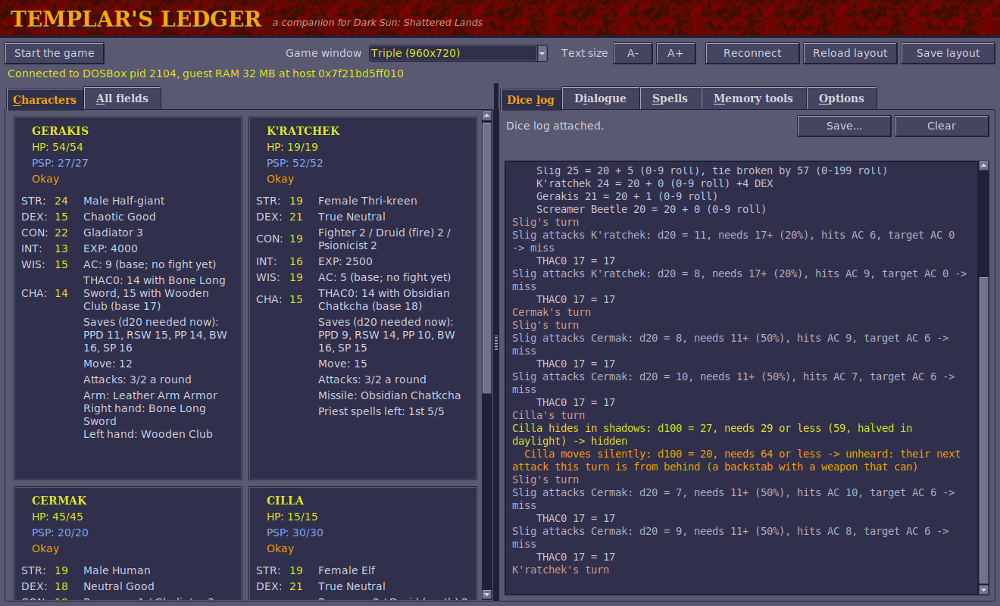
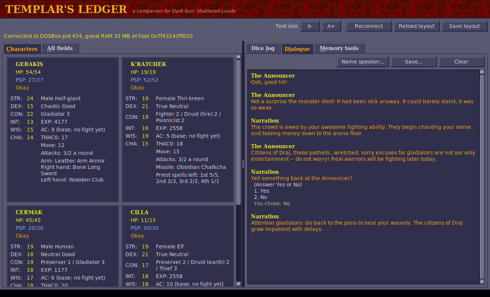
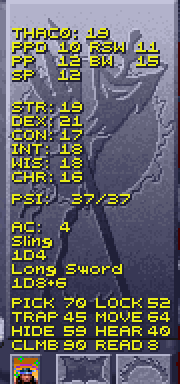
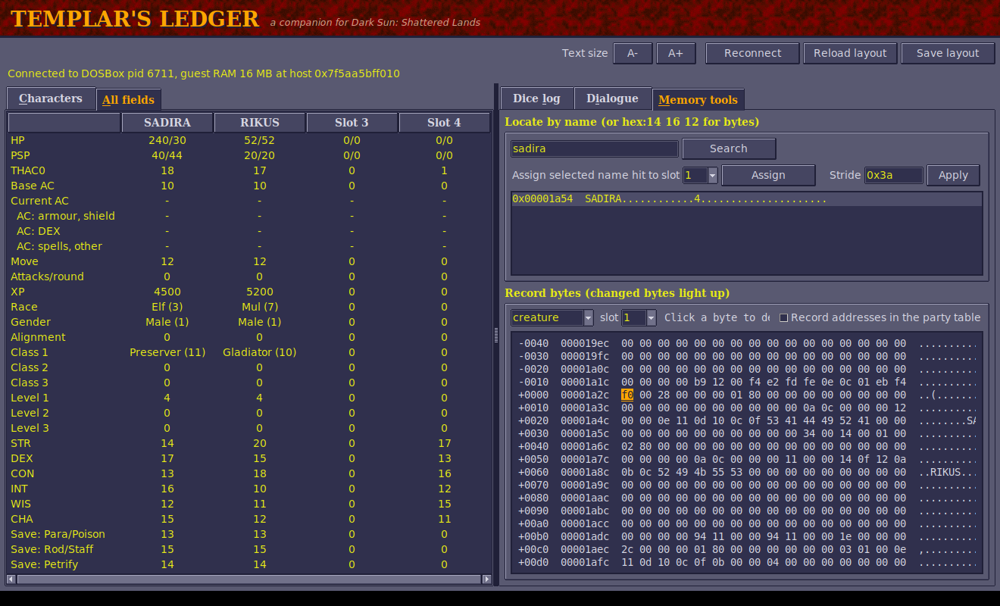

# Templar's Ledger

A companion for **Dark Sun: Shattered Lands** (the GOG release) running in
DOSBox, in the spirit of the Gold Box Companion. In Draj the templars keep the
records; this ledger keeps the ones the game doesn't show you. It has three
parts:

- **Party viewer:** every party member's stats, live, including numbers the
  game doesn't show (THAC0, saving throws, attacks per round, the AC the game
  uses in a fight and what it's made of, class ids).
- **Dice log:** the rolls the game makes behind the scenes, with what they were
  compared against and where every bonus comes from. For example:

  ```
  Round 2: Dag 27, Mountain Stalker 25, Daaki 21, Red Slaad 20
  Dag's turn
  Dag attacks Mountain Stalker with Long Sword +1 (1d8+1): d20 = 18, needs 4+ (85%), hits AC -10, target AC 4 -> HIT
      THAC0 16, +1 Blessed, +6 STR, +1 weapon = 8
    Dag hits Mountain Stalker for 20: 1d8 = [7] +1 weapon +12 STR 24
    Mountain Stalker now 12/32 HP (-20)
  Fireball damage: 9d6 = [3 + 2 + 3 + 4 + 5 + 4 + 1 + 2 + 2] = 26
  Red Slaad magic resistance 30% vs Fireball: d100 = 71 -> not resisted
  Red Slaad saves vs Fireball from Daaki (petrification/polymorph): d20 = 6, doubled against fire = 12, needs 11 (75% to save) -> saved: half damage, 13 of 26
    Red Slaad takes 13 from Fireball, now 47/60 HP
  Jellybelly gives Blessed to Daaki: +1 to hit, +1 on saves
  Slig is killed (270 XP)
  XP: Gerakis +67, K'ratchek +22, Cermak +67, Cilla +22 (for Slig 270)
  ```
- **Dialogue:** what characters say, the replies you're offered and the one
  you picked, kept in a tab you can scroll back through.
- **In the game itself:** the inventory screen also shows each character's
  THAC0, saving throws and (for thieves) thief skills, in the game's own
  lettering (see [In the game](#in-the-game-thac0-saves-and-thief-skills)).

Nothing in the game folder or your save files is changed. The viewer only reads
memory. For the dice log, the launcher runs a patched copy of the game that it
keeps in its own folder (see
[How the dice log works](#how-the-dice-log-works)).

The window is dressed in the game's own colours: its grey stone panels, the
amber of its dialogue, the yellow of its character screen and the red rock of
the arena, all sampled from the game (no game artwork is copied).







## Requirements

- **Windows** with DOSBox (plain DOSBox 0.74, DOSBox Staging, or the DOSBox
  bundled with the GOG/Steam release).
- **64-bit Python 3.8+** from python.org. It includes tkinter and needs no extra
  packages. Use 64-bit Python because 64-bit DOSBox can't be read from 32-bit
  Python.
- Linux works too if you can read other processes' memory (root, or
  `kernel.yama.ptrace_scope=0`).

## Running it (Windows)

Templar's Ledger is a separate program that runs next to the game. You don't
install anything into the game folder.

**One-time setup**

1. Install Python from <https://www.python.org/downloads/>. On the first
   installer screen, tick **"Add python.exe to PATH"**.
2. Download this project: on GitHub open the `templars-ledger`
   branch, click **Code → Download ZIP**, and unzip it anywhere.
   The files you need are in the `darksun-companion` folder.

**Every time you play**

Double-click **`Start Game with Dice Log.bat`** in the `darksun-companion`
folder. It starts Shattered Lands (through GOG's own DOSBox) with the dice log
helper loaded, and opens Templar's Ledger next to it. Your saves are the same ones
the game normally uses. The first time, it looks for
the game in the usual GOG folders; if it can't find it, it asks you where the
game is installed and remembers the answer.

Load your game. The party's stats fill in by themselves, and rolls appear in
the **Dice log** tab as they happen.

If you start the game the normal way instead, **`Start Templar's Ledger.bat`** still
shows the party, but the dice log will say the game was started without it.

**Checking a save file (no game needed):** drag a `SAVEnn.SAV` file from the
game folder onto **`Show Save.bat`**.

**From a command prompt**, the same things are (`dscompanion` is the program's
internal name):

```
python -m dscompanion launch                        # start the game with the dice log, and the viewer
python -m dscompanion view                          # the viewer only
python -m dscompanion dicelog                       # the dice log in the command prompt
python -m dscompanion save C:\path\to\SAVE01.SAV   # the party stored in a save
python -m dscompanion processes                     # is DOSBox found?
```

If more than one DOSBox is running, add `--pid <number>` (from `processes`).

## The dice log

| Line | Meaning |
|---|---|
| `Round 2: K'ratchek 32, Cermak 31, Cilla 30, Gerakis 26, Slig 26` | A new round of a fight, numbered from the fight's start, and the order everyone acts in (highest first). The lines under it (shown with **Show details**) give each score's make-up: `    Gerakis 26 = 20 + 6 (0-9 roll), tie broken by 38 (0-199 roll)` (see Initiative below). If the log was started in the middle of a round, the list has only the rolls it saw. |
| `Gerakis's turn` | Whose turn it is now, each time the turn passes in a fight. |
| `X attacks Y with Long Sword +1 (1d8+1): d20 = 14, needs 12+ (45%), hits AC 1, target AC 3 -> HIT` | An attack roll, the weapon and its damage dice. `needs 12+ (45%)` is the d20 this attacker needed against this target (THAC0 − target AC) and the chance of rolling it; `hits on anything but a 1` or `only a 20 hits` when it's out of the ordinary range. `X attacks Y from behind ...` and `X attacks Y BACKSTAB ...` mark attacks from behind and backstabs (see below). "Hits AC" is the lowest AC this roll hits (THAC0 − d20); the target AC is the one the game used, with armour, DEX and spells. A natural 20 always hits and a natural 1 always misses. |
| `    THAC0 16, +1 Blessed, +6 STR, +1 weapon = 8` | Where the attacker's THAC0 for this attack comes from: STR (melee) or DEX (missiles), spells (Bless, Prayer, Slow, Graft Weapon, the target's Blur), attacking from behind, the weapon's plus, the penalty for non-metal weapons (wooden −3, bone −1, stone and obsidian −2), the two-weapon adjustment (see below), and the difficulty setting for monsters. |
| `  X hits Y for 14: 1d8 = [6] +8 STR 20` | The damage of that hit: the dice, the weapon's bonus, and the STR bonus the game adds for melee. Damage is at least 1. |
| `  X hits Y for 51: (1d8 = [5] +12 STR 24) x3 backstab` | A backstab (see below) multiplies the whole damage, STR bonus included. |
| `Shocking Grasp damage: 1d8 = [5] +10 = 15 (1d8 + 1 for each caster level: 10 at caster level 20, which counts as 10)` | A spell's damage roll, rolled for each target before its saving throw, with the spell's formula from the game's data. Damage stops growing at caster level 10 (Fireball does at most 10d6). Magic Missile, Flame Arrow and Minute Meteors are rolled elsewhere in the game, without the caster's level, so their line says how many steps the dice stand for. |
| `  Slig takes 15 from Shocking Grasp, now 3/18 HP` | What the spell really did to each creature, after its save, resistances and protections (or the healing it gave). A creature that is Out Cold gets no save and takes the most the dice can do (the game's damage code does that), marked `(Out Cold: the most the dice can do)`. |
| `    Blur lasts 23 rounds (caster level 20: 1 for each caster level = 20 + 3 from the dice; dice 3d1)` | How long a spell's effect lasts, and how the game worked it out. A round is 60 game seconds. The game often "rolls" dice with one side, which are fixed numbers. |
| `    Stoneskin has 23 charges (caster level 20: 1 for each caster level = 20 + 3 from the dice; dice 1d4 = [3])` | Effects that last a number of uses rather than a time (Stoneskin's blows, Mirror Image's images, Invisibility's one attack, Poison's rounds): the game stores them as charges, worked out like a duration. |
| `    Acid on Slig: 2d4 = [3 + 1] = 4 acid damage` / `    Ironskin on Cilla: one charge used` | Acid Arrow's damage each round while the acid lasts; and an effect with charges using one up (Stoneskin or Ironskin stopping a blow, Mirror Image losing an image...). |
| `Strength: 1d6 = 5 -> Cilla's STR +5 while it lasts (at most 24)` | The amount Strength (or Adrenalin Control) adds. |
| `Y magic resistance 30% vs Fireball: d100 = 71 -> not resisted` | The magic resistance roll (only shown for targets that have some), counting Mind Bar and Lower Resistance. |
| `    Dispel Magic on Slig's Blessed: d100 = 60, needs 85 or less (50 + 5 x 7 - 5 x 0 (its caster's level)) -> dispelled` | Dispel Magic tries each effect on its target separately: 50 + 5 for each of the dispeller's levels, less 5 for each of the level the effect was cast at. It can't touch some (Biofeedback, Diseased, Feeblemind, Poisoned, Graft Weapon, No spell use, Stuck, Mind Bar and a few more). |
| `    Abjure on Y: d20 = 14, needs 12 or more (11 - caster level 5 + its level 6) -> sent away` | Abjure sends a summoned creature away (1000 damage) on a d20 at or over 11 - the caster's level + the creature's. |
| `    Summoning: 1d3 = 2 picks which of its 3 creatures comes` | Which creature a summoning spell brings. |
| `Y saves vs Fireball from X (petrification/polymorph): d20 = 6, doubled against fire = 12 +1 modifiers (incl. Blessed) = 13, needs 11 (80% to save) -> saved: half damage, 19 of 38` | A saving throw: which of the target's five saves it uses, the d20, the game's modifiers, and the number it had to reach. The game doubles the d20 against fire, cold and electricity spells (see Spells and effects). A natural 1 always fails and a natural 20 always saves. The chance of saving is worked out for you (`needs 14 (70% to save)`); with the doubled d20, Fireball's victims usually save. For a damaging spell the result says what the save left, from that target's damage roll just before it: `saved: half damage, 19 of 38`, `failed: full damage, 38`, or `saved: no damage` for spells such as Chill Touch. The HP line after it shows what the creature really lost, once resistances and protections have had their say. A failed save also lets the spell's effect take hold. Spells left on the ground (Grease, clouds) make creatures save again as they stay in them; those lines have no "from". |
| `X gives Blessed to Y, Z: +1 to hit, +1 on saves` / `Blessed ends on Y` | A spell or psionic effect starting or ending, with what it does in the game's code where that is known: to-hit, AC and saving throws, movement and attacks, whether the creature can attack or cast, who controls it (see Spells and effects below). `Stuck on Y` (no "gives") is an effect a creature has from a spell on the ground or cast on itself. |
| `X DEX check: d20 = 9, needs 16 or less (DEX 16) -> success` | An ability check. A natural 20 always fails. |
| `Cilla tries to open locks: d100 = 35, needs 40 or less -> success` / `    open locks 40 = 18 + 16 thief level 4 + 10 elf... - 5 armour` | A thief skill roll (see Thief skills below), and what its chance is made of. |
| `    X's Bone Long Sword nearly broke: 0 on 0-7, then 12 on 0-19 (needed 0)` / `... BREAKS` | The weapon check the game makes after an attack sequence whose last attack hit. Only non-magical wood, bone, stone and obsidian weapons can break (and not every kind: clubs and quarterstaffs can't): they break when a 0-7 roll and then a 0-19 roll both come up 0, 1 chance in 160. The line only appears when the first roll comes up 0. |
| `Message: Long Sword is broken !` | The game's own message boxes: broken or corroded weapons and armour, level-ups, "NO PATH FROM HERE" and so on. |
| `  Slig now 8/18 HP (-10)` / `  Gerakis now 51/54 HP (+1)` | Any combatant's hit points going down or up, with what's left out of their most. The game never shows a monster's HP; this does. The line comes just after the damage that caused it (sometimes after the next roll, when the game is quick). |
| `    X's special effect on Y: d10 = 1, works on a 1 -> it works` | The 1-in-10 extra effect some creatures' hits have (the thri-kreen bite, for one). |
| `Slig is killed (270 XP)` | A creature dying, with the XP it's worth (from its character sheet). |
| `XP: Gerakis +67, K'ratchek +22, ... (for Slig 270)` | Experience the party got, and for which kills. The game gives it right after the kill: an equal share to each character, split again between a multi-class character's classes (the sheet counts XP per class, so a three-class thri-kreen shows a third of the share). |
| `Cilla is now a 3rd level Ranger` / `    max HP 15 -> 21 (+6)` | A level gained, and the new maximum HP. |
| `    no hit point roll: that comes only when the highest class level rises (still 3rd)` | A multi-class character's level in one class went up without raising their highest level: the game gives no hit points for it. |
| `Cilla's 3rd Ranger level: hit points d10 = 2, raised to 3 for CON 21` | The hit point roll for a new level: the class's die (d8 clerics and druids, d10 fighters, gladiators and rangers, d4 preservers, d6 psionicists and thieves), never less than 2, 3 or 4 with CON 20, 21-22 or 23+, and doubled for half-giants. After level 9 or 10 there's no roll, just a fixed gain. |
| `Character creation, STR 17: best of four 4d4 (7, 11, 9, 10) = 11, +4, +1 dwarf = 16, raised to 17 (the Fighter's prime requisite)` | An ability score rolled on the character creation screen (see below). |
| `Character creation, hit points 15: Fighter d10 per level: 7 + 9; Thief d6 per level: 5 + 1 = 22, / 2 classes = 11, +4 CON 16 = 15` | The new character's hit points: a die for every level of every class, divided by the number of classes, plus CON's bonus (see below). |
| `Character creation: a name picked at random, 1d33 = 6` | The game picks a new name from its lists when the sex or race changes. |
| `Dice: 1d8 = [3] = 3` | Dice the log couldn't tie to anything (for example a spell with no saving throw). |

**Reading it at a glance.** Lines at the left edge are the events: a round
starting, whose turn it is, attack rolls, saves, spells, kills. Lines indented
two spaces are their results (damage, HP left); lines indented four spaces are
the details: the sums behind a THAC0, a save's modifiers, the initiative
scores. Untick **Show details** to hide the details and keep the rest; they
come back when it's ticked again. In the window, each kind has its colour
(hits green, misses grey, damage amber, saves blue, turns sand, rounds
underlined with a gap above), but the words say the same thing, so nothing
depends on telling colours apart.

**Show unlabelled rolls** also lists everything else the game randomises
(creatures wandering, animations and so on), as raw numbers with where in the
game's code they came from. It's noisy, but useful for finding more rolls worth
labelling.

Tested in play: the attack and damage lines match the HP the game takes off,
for both the party and the monsters, and every saving throw of a Fireball is
logged.

The viewer's **Current AC** row is the AC the game last used for each
character in a fight (armour, DEX and spells included), and the rows under it
say what it was made of: armour and shield (and spells that take their place,
such as Spirit Armor and Magical Vestments), DEX (the game's table: −1 at 15
down to −6 at 24; not counted when attacked from behind), and spells and
anything else. They show "-" until the game has worked out that character's AC
in a fight.

Ability scores such as `STR 24 (20 without spells)` show the score now and, in
brackets, the character's own score when a spell (Strength, for one) has
raised it. The character's own score already includes the racial adjustment:
a half-giant's 20 + 4 shows as 24.

### Initiative

From the game's code: at the start of every round each combatant's initiative
is 20 + a roll of 0-9 + a DEX adjustment + Hasted +2, Slowed −2 and Blind −2.
The DEX adjustment has its own table: −6 at DEX 1, −4 at 2, −3 at 3, −2 at 4,
−1 at 5, none for 6-15, +1 at 16, +2 at 17-18, +3 at 19-20, +4 at 21-23 and
+5 at 24-25. The weapon makes no difference (there are no weapon speeds). The
highest score acts first; a second roll, 0-199, decides between equal scores
(the log shows it only for those). Choosing Wait lowers the character's score
to 10 (or by one, if it's 10 or less already) so they act later in the round.

### Two weapons

The manual says a character with two weapons ready uses the second "at a
disadvantage", unless a ranger or dextrous. The game's code does something
else: with two weapons ready (in melee), every attack, first hand and second
alike, is adjusted by the DEX table used for initiative with its sign flipped
and never below 0, and rangers are left out. That comes to a **bonus** of +6 at
DEX 1, +4 at 2, +3 at 3, +2 at 4 and +1 at 5, and nothing at DEX 6 and up, so
in practice there is no off-hand penalty at all: both weapons hit as well as a
single one would. The log names it, e.g. `+2 two weapons at DEX 4`.

Tested in one arena fight by changing DEX in memory: a gladiator with a club
and a bone long sword got +6 on **both** weapons at DEX 1 (THAC0 11 and 12
became 5 and 6), and nothing at DEX 15 or 25; a character with one weapon
(a quarterstaff) got nothing at DEX 1. The game rolled damage for every
logged hit and none for the misses (46 attacks), including a d20 of 4 that
only hit because of the +6. It looks like a sign slip in the game: AD&D uses
the same DEX adjustment to make two-weapon fighting *harder* at low DEX.

### Spells and effects

What the log says about spells comes from the game's own spell records and
code, checked by casting each spell in a fight. Where the game differs from the
AD&D rules, the log follows the game.

**Damage.** Each spell's record gives its dice: base dice plus dice (and a flat
bonus) for each step of caster level, counted up to level 10. So Fireball and
Lightning Bolt do at most 10d6, and Burning Hands 1d3 + 2 a level. A save halves
the damage, or stops it all for spells such as Chill Touch. A creature that is
Out Cold gets no save and takes the most the dice can do.

**Fire, cold and electricity: the save's d20 counts double.** Each spell's
record has a word of flags saying what kind of damage it does, and the saving
throw code doubles the d20 whenever the kind is fire, cold or electricity
(`test word [flags], 86h` then `shl al, 1` in DSUN.EXE). Nothing else is
doubled: not acid (Acid Arrow), crushing (Ice Storm, Magical Stone), poison
(Cloudkill), draining (Vampiric Touch, the Cause Wounds spells) or the
psionic attacks. The doubled spells are:
- fire: Burning Hands, Flaming Sphere, Fireball, Flame Arrow, Minute Meteors,
  Fire Shield, Wall of Fire (both), Focus Heat, Produce Fire, Flame Strike;
- cold: Chill Touch, Cone of Cold;
- electricity: Shocking Grasp, Lightning Bolt.

A natural 1 still fails and a 20 still saves, but in between the doubled roll
makes saving far easier: needing 14, a normal d20 saves 35% of the time and a
doubled one 70%. That's why Fireball's victims usually get away with half
damage. It isn't AD&D, and the game never explains it, so why SSI did it is a
guess; it may have been meant as a dodge that makes energy blasts a gamble.
The log says it on each save: `d20 = 7, doubled against fire = 14`.

Almost every spell in the game is saved against with **petrification/polymorph**
(its code maps the spell's save kind 5 to the sheet's third save; kind 1 is
paralysis/poison/death, used by the clouds, Poison, Slay Living and the psionic
attacks). The spell save, the one AD&D uses for spells, is never used. That
was checked against the AD&D tables: a 3rd-level warrior needs 13 against
Psychic Crush (paralysis) and 14 against Fireball (petrification), where the
spell save would be 16.

**How long.** A duration is (caster level × so much + dice) × a unit of time.
A round is 60 game seconds. Some effects last a number of uses instead
(charges):
- Stoneskin: 1 a level + 1d4. Any damage uses a charge, even fire that gets
  through, but only blows are stopped.
- Ironskin: 1d6 blows stopped.
- Mirror Image: 1 a level + 1d4 images. Each weapon attack has a 75% chance to
  hit an image.
- Invisibility: one attack or hostile spell ends it. Improved Invisibility is
  timed instead, so attacking doesn't end it.
- Minor Spell Turning: one spell turned back.

Charm, Feeblemind, Web and a few others last until removed.

**What effects do**, from the game's code:

| Effect | In the game |
|---|---|
| Blessed / Cursed | +1 / −1 to hit (Bless also +1 on saves); each one cancels the other instead of being added |
| Hasted / Slowed | Hasted: double movement and attacks, +2 initiative. Slowed: half movement and attacks, loses every other turn, −4 to hit, AC 4 worse, −2 initiative. Each cancels the other; Free Action and Protection from Paralysis stop Slow |
| Paralyzed | Loses its turns, can't move, fails every saving throw. Free Action and Protection from Paralysis stop it |
| Stuck (Grease, Web, Entangle, Solid Fog, Quicksand) | Can't move; Free Action stops it; some creatures are immune |
| Afraid | The computer runs it; it can't attack or cast. Undead are immune, and Cloak of Bravery stops the next fear (and ends) |
| Charmed | Joins the caster's side, run by the computer |
| Confused | Each turn a d10: 1 runs off, 2–6 does nothing, 7–9 fights for a side picked with a d2, 10 acts normally (the log shows the rolls) |
| Berserk | Fights for a side picked at random each turn; can't cast |
| Can't Attack (Stinking Cloud) | Can't attack or cast harmful spells |
| No spell use, Feeblemind | Can't cast spells |
| Blind | AC 4 worse, −2 initiative, can't cast spells that need sight |
| Acid (Acid Arrow) | 2d4 acid damage each round |
| Poisoned | Fatal (1000 damage) if time passes out of combat, for instance resting, before it wears off or is cured |
| Cloak of Fear | Whoever hits the wearer has Cause Fear cast on them, once |

Other things the game does its own way:
- Cause Serious Wounds rolls 2d9, and Cause Critical Wounds 3d9 (AD&D: 2d8+1
  and 3d8+3). The Cure spells are 1d8, 2d8+1 and 3d8+3 as in AD&D.
- Strength adds 1d6 to STR while it lasts, up to 24. The same goes for
  the psionic Adrenalin Control, and Weakened or lending strength takes it away
  (never below 3).
- Shillelagh, Flame Blade and Spiritual Hammer need an empty hand: with a
  weapon ready the game says "Failed, weapon in hand" and nothing happens.
- Death spells (Slay Living, Dismissal) do the target's HP + 10 on a failed save.
- In the arena, summonings fail ("Your summoning goes unanswered").
- A spell's caster level is the caster's highest level in a class that shares
  a sphere with the spell. Priests have one element each (cleric, druid and
  ranger classes come in air, earth, fire and water): Flame Blade, Focus Heat
  and Flame Strike are fire spells, Blood Flow and Dehydrate water, Deflection
  air, while spells such as Bless, Barkskin or Spiritual Hammer belong to
  every sphere. Cast by a priest of another element, an elemental spell counts
  caster level 0. The game shows each priest only their element's spells, so
  this only happens if a character somehow has the others. The log's
  `caster level 0` lines in testing came from an earth druid given every spell.

The spell's area catches its caster too. Cilla's Scare made her Afraid, and her
Fireball, cast at a Slig next to her, killed her.

### Thief skills

The game never shows thief skills, but it rolls them: for locks, traps and
other things its scripts ask for. Sometimes it's the party's best member at it
who tries. The roll is a d100 that must come in under the skill's chance. The
game's code works the chance out as:
- a base for each skill (28, 18, 13, 28, 18, 23, 78, −4),
- plus 4 for each thief level,
- plus a racial adjustment. These are AD&D's, for example a dwarf gets +10 to
  open locks, +15 to find traps, −10 to climb walls and −5 to read languages.
- plus DEX: −5 for each point below 12, 11, 12, 13 or 11 (the first five skills);
  +5 for each point above 16, 15, 17, 16 or 16; and −3 for each point above
  21, 20, 21, 19 or 19, so very high DEX gains less,
- minus an armour penalty (5, 0, 0, 10, 5, 0, 10, 0) when the thief wears
  anything but leather,
- plus the situation's bonus or penalty (a hard lock, say).

Only characters with thief levels have the skills. The exception is finding
traps: anyone with Find Traps on them can try. The character must be Okay.

Some effects rule out a skill:
- Blind, Afraid, Confused, Berserk and Paralyzed stop them all, except that a
  blind thief can still hear noise.
- Slowed stops all but picking pockets.
- Fire Shield stops picking pockets and hiding; Mirror Image stops hiding.
- Graft Weapon stops picking pockets, opening locks and climbing.
- Feeblemind stops reading languages.
- Enlarge scales the situation's bonus or penalty, not the skill: for hiding it's
  divided by (100 + 10 × Enlarge's level)%, for climbing multiplied by it. With
  no bonus or penalty it changes nothing; with a penalty, climbing gets harder.

These effects work on the situation's bonus: ruling a skill out takes 1000 off
it, so the roll can't succeed.

The game gives the skills no names. The eight are AD&D's in AD&D's order (pick
pockets, open locks, find/remove traps, move silently, hide in shadows, hear
noise, climb walls, read languages): the checks above fit them.

The **Characters** tab shows each thief's chances before armour and the situation.
**All fields** has them in a row in that order.

### Psionics

Psionic powers are numbered after the spells (Detonate 138 to Thought Shield
171) and go through the same code: the same records for damage, saves and
effects, so the log treats them like spells and names them. Some things are
their own:

- **Level.** A power works at the character's psionicist level; anyone else
  with psionic powers counts as level 1.
- **PSP.** A power costs its PSP to use. Kept-up powers (Inertial Barrier,
  Biofeedback, Graft Weapon...) cost more PSP at the start of each round, and
  the game puts them on again for another round; when the PSP runs short, the
  power drops. The log shows every change in a party member's PSP
  (`    K'ratchek spends 18 PSP (52 -> 34)`).
- **Psionic defence.** Attacked by a psionic attack mode (Psychic Crush, Ego
  Whip, Id Insinuation, Psionic Blast), a character automatically raises the
  best defence mode they know and can pay for, and pays its PSP.
- **Mind Bar** adds 75% magic resistance against mind-affecting spells:
  charms, holds, Scare, Confusion, Chaos, Feeblemind, Minor Malison. The log's
  magic resistance line counts it, and Lower Resistance halving the result.
- **Body Weaponry** makes unarmed attacks 2d4; **Animal Affinity** at least 1d10.
- Monsters use them too: the Screamer Beetle's "special attack" in earlier
  logs was Psychic Crush (1d8, save vs paralysis/poison/death for half).

What each costs, from the game's own table (it differs from the books in
places: Enhanced Strength and Domination cost nothing to start):

| Power | Discipline | PSP to use | PSP each round kept up |
|---|---|---|---|
| Detonate | psychokinesis | 18 | — |
| Disintegrate | psychokinesis | 40 | — |
| Project Force | psychokinesis | 10 | — |
| Ballistic Attack | psychokinesis | 5 | — |
| Control Body | psychokinesis | 8 | — |
| Inertial Barrier | psychokinesis | 7 | 5 |
| Animal Affinity | psychometabolism | 15 | 4 |
| Energy Containment | psychometabolism | 10 | — |
| Life Draining | psychometabolism | 11 | — |
| Absorb Disease | psychometabolism | 12 | — |
| Adrenalin Control | psychometabolism | 8 | 4 |
| Biofeedback | psychometabolism | 6 | 3 |
| Body Weaponry | psychometabolism | 9 | 4 |
| Cell Adjustment | psychometabolism | 5 | — |
| Displacement | psychometabolism | 6 | 3 |
| Enhanced Strength | psychometabolism | 0 | 8 |
| Flesh Armor | psychometabolism | 8 | 4 |
| Graft Weapon | psychometabolism | 10 | 1 |
| Lend Health | psychometabolism | 4 | — |
| Share Strength | psychometabolism | 6 | 2 |
| Domination | telepathy | 0 | — |
| Mass Domination | telepathy | 0 | — |
| Psychic Crush (attack mode) | telepathy | 7 | — |
| Superior Invisibility | telepathy | 5 | 5 |
| Tower of Iron Will (defence mode) | telepathy | 6 | 0 |
| Ego Whip (attack mode) | telepathy | 4 | — |
| Id Insinuation (attack mode) | telepathy | 5 | — |
| Intellect Fortress (defence mode) | telepathy | 4 | 0 |
| Mental Barrier (defence mode) | telepathy | 3 | 0 |
| Mind Bar | telepathy | 6 | 4 |
| Mind Blank (defence mode) | telepathy | 0 | 0 |
| Psionic Blast (attack mode) | telepathy | 10 | — |
| Synaptic Static | telepathy | 15 | 10 |
| Thought Shield (defence mode) | telepathy | 1 | 0 |

### Character creation

Every click of the die on the creation screen (and every change of race or sex)
rolls a new character. From the game's code, and checked against the screen:

* **Abilities.** Each score is rolled four times as 4d4 + 4 + the race's
  adjustment, and the best of the four counts. That's 8 to 20 before the race's
  adjustment. The score is then raised, if need be, to the least that the
  classes allow: 17 in the class's prime requisite (STR for fighters and
  gladiators, WIS for clerics, druids, psionicists and rangers, INT for
  preservers, DEX for thieves), and otherwise 9 (clerics, fighters, preservers,
  thieves), 12 (druids, psionicists), 13 (gladiators) or 14 (rangers). A
  multi-class character takes the highest of their classes' minimums.
* **Race adjustments** (STR, DEX, CON, INT, WIS, CHA): dwarf +1 −1 +2 0 0 −2;
  elf 0 +2 −2 +1 −1 0; half-elf 0 +1 −1 0 0 0; half-giant +4 −5 +2 −5 −3 −3;
  halfling −2 +2 −1 0 +2 −1; mul +2 0 +1 −1 0 −2; thri-kreen 0 +2 0 −1 +1 −2.
  Humans have none.
* **Hit points.** One die for every level of every class (d8 clerics and
  druids, d10 fighters, gladiators and rangers, d4 preservers, d6 psionicists
  and thieves), doubled for half-giants. The total is divided by the number of
  classes (rounded down), and then CON's bonus is added for every level: a
  warrior's full bonus (+1 at CON 15, +2 at 16, +3 at 17, +4 at 18, +5 at
  19-20, +6 at 21-23, +7 at 24-25; −1 at 4-6, −2 at 2-3, −3 at 0-1), and at
  most +2 for levels in the other classes. There is no automatic maximum at
  first level: the first level rolls like the rest.
* **Choices without dice.** Raising a score to a new class's minimum (adding
  Thief raises DEX to 17) and PSP aren't rolled, so they don't appear in the
  log. The creation screen's other random numbers only choose pictures.

Changing sex or race can make the game roll hit points twice, once with the
old scores and once with the new: the last hit point line is the one that
counts.

### Attacks from behind and backstabs

From the game's code:

- An attack is **from behind** when the attacker stands in the square directly
  behind the way the target is facing. A creature faces nowhere in particular
  at the start of each round; the first attack on it in the round turns it
  to face that attacker (one of eight directions), and it keeps facing that
  way for the rest of the round. So a second attacker on the far side, later
  in the same round, attacks from behind. (Its own attacks don't turn it.)
  It gets +2 to hit, and the target loses its DEX bonus and its shield.
- A **backstab** is an attack from behind by a thief, in melee, with a weapon
  that isn't too heavy (the game's weight value at most 40; a long sword's
  is 20). It gets another +2 to hit (+4 in all), and on the thief's first
  attack of the round the damage, STR bonus included, is multiplied: x2 at
  thief levels 1-4, x3 at 5-8, x4 at 9-12, x5 from 13.

### In the game: THAC0, saves and thief skills

Started with the dice log, the game's own inventory screen (the one with the
character's figure and their equipment) shows three more things in its
right-hand panel, drawn by the game's text routine so they look like the rest:

- above STR, **THAC0** and the five **saving throws**, with the usual AD&D
  short labels: `PPD` paralysis/poison/death, `RSW` rod/staff/wand, `PP`
  petrification/polymorph, `BW` breath weapon, `SP` spell;
- below the weapons, for a character with thief levels, the eight **thief
  skills**: `PICK` pockets, open `LOCK`s, find/remove `TRAP`s, `MOVE`
  silently, `HIDE` in shadows, `HEAR` noise, `CLMB` walls, `READ` languages.

They're read from the character when the screen is drawn, so they follow
level-ups, and the next character's show when you pick another portrait.
They're the character's own numbers, as on a paper character sheet: THAC0 and
saves before the weapon, STR, magic and spells that the game adds at the
moment of each attack or save (the dice log shows those), and thief skills
before armour and the situation (see Thief skills). With three weapons ready
the weapon lines leave no room above the buttons, and the thief skills are
left out.

How: the patched game calls the helper (`INT 65h`) just after the panel's
weapon lines; the helper prints the lines with the game's own text routine,
whose address, like the selected character, it reads from the game's code
around the patch (overlays move, so nothing is fixed in advance). Nothing else
in the game changes.

### The Dialogue tab

Everything the game shows in its dialogue window, one entry per window of
text, with the replies offered numbered underneath (and the list's title,
such as "Answer Yes or No", above them), and then the one you picked:
`You chose: No`. (The game keeps the clicked row at DS:1F0A while it flashes
it; the log reads the reply's text from the game's own list.)

**Who's speaking.** The game's dialogue window gets only a portrait number,
never a name, so a speaker the log can't name shows as `Portrait 57`. Portrait
119 is named `The Announcer`, as the game itself calls him ("Yell something
back at the Announcer?"). To name any other speaker, right-click the name
line in the Dialogue tab, or press **Name speaker...** (it names the latest
speaker). The name replaces the number on every line from that portrait,
the ones already shown included, and is remembered in `settings.json` for
next time (the command-line log uses it too). Leave the name empty to go back
to the number. Text shown without a face (the emblem instead) is `Narration`.

Each entry shows the speaker's portrait, as the game's own dialogue window
does. Portraits and the title's lettering are read from your installed game
at run time (GPLDATA.GFF and RESOURCE.GFF in the install folder the launcher
remembers); nothing from the game is copied into Templar's Ledger. Without
the game installed the window uses its own lettering and no portraits (the
screenshots here are taken that way).

### How the dice log works

Every roll in the game goes through one function, Borland C++'s `rand()`.

1. When you start the game with the dice log, the launcher writes
   `dos\DSUNLOG.EXE`: a copy of the game's `DSUN.EXE` with a few small changes
   (`dscompanion/gamepatch.py`). The start of `rand()`, the end of the saving
   throw, the end of the AC calculation, the start of the routine that fills
   the dialogue window and the start of the message box routine become
   `INT 60h` to `64h`, the inventory screen's panel calls `INT 65h` (see
   In the game), and the copy looks for its data files in the current
   folder rather than next to itself. DOSBox runs it from the game folder, so
   it uses your saves as usual.
2. `dos\DSCLOG.EXE` (source in `dos\dsclog.asm`) is a tiny DOS program loaded
   into upper memory before the game, so the game loses no memory. It answers
   those interrupts. Its `rand()` returns exactly the numbers the original
   would and also records each call, what code called it, and that code's
   arguments (dice count and sides, THAC0, AC...) in a ring buffer. The others
   record the final saving throw total, the AC the game uses, and the text
   of dialogues and messages (in a second buffer).
3. Templar's Ledger finds the buffer in DOSBox's memory and reads it every 50 ms.
   It works out what each roll was for from the code that asked for it, and
   reads the rest (names, weapons, spells, effects) from the game's own data.
4. To keep bursts of unimportant randomness from crowding out the rolls that
   matter, the helper only records calls from code it knows how to label,
   unless **Show unlabelled rolls** is ticked.

Because the replacement produces identical numbers, the game plays exactly as
it would without it.

Limitations:
- Only the GOG release (`DSUN.EXE` of 611,408 bytes) is supported. With
  another version the launcher starts the game without the dice log and says
  why.
- Rolls made outside combat (for example treasure or random encounters) show
  up only with **Show unlabelled rolls**, as raw numbers.
- A save-file load from the main menu is recognised, so the spells already
  active in it aren't reported as new. Loading a save of the same party in the
  middle of play isn't, and its effects may be listed as if just cast.
- Dialogue speakers are portrait numbers until you name them (see above):
  the game doesn't keep a name with the dialogue.
- Weapon breaking was checked against the game's code, and the check's rolls
  were seen in play, but no weapon happened to break during testing; the
  game's own "is broken !" message is logged either way.

## Accessibility

Templar's Ledger aims at the AODA's standard for software people read,
WCAG 2.0 level AA:

- **Contrast:** every colour used for text has at least 4.5:1 contrast with
  its background (the game's lighter stone is kept for bevels, not behind
  text). `tests/test_theme.py` checks each pair.
- **Colour is never the only signal:** log lines say `HIT`, `miss`, `saves`
  and so on in words, and changed bytes in the record view are underlined as
  well as highlighted.
- **Text size:** **A+** / **A-** at the top, or **Ctrl +**, **Ctrl -** and
  **Ctrl 0** (back to normal), enlarge or shrink all text up to 2.5 times.
- **Keyboard:** Tab and Shift+Tab move between controls, and the one with the
  keyboard focus is outlined in yellow. **Ctrl+Tab** switches tabs, as do
  **Alt+L** (Dice log), **Alt+I** (Dialogue) and **Alt+M** (Memory tools),
  and on the party side **Alt+C** (Characters) and **Alt+A** (All fields).
- **The game's font** is only used for the title: it's a 9-pixel bitmap
  font, fine enlarged as a heading but harder to read than ordinary text,
  so everything else is in the system's fonts.
- **Screen readers:** tkinter's windows are not read well by screen readers.
  **Save...** on the Dice log and Dialogue tabs writes the log to a text file,
  and `python -m dscompanion dicelog` prints the same log (dialogue included) in
  a command prompt, which screen readers do read.

## Using the viewer

The party pane has two tabs:

- **Characters** (Alt+C): a card for each character, laid out like the game's
  View Character screen. It shows the figure for their race and sex (the one
  on the character creation screen, read from your install) and their name.
  Then HP and PSP as the game shows them (PSP in blue). Then their condition
  (the game's Okay, Stunned, Out Cold, Dying, Dead, Animated, Petrified or
  Gone, followed by any spells and effects on them, with the rounds or charges
  each has left: `Blur (22 rounds)`, `Stoneskin (5 charges)`; from the game's own
  clock and timers). Then the character
  sheet: scores, sex, race and alignment, classes and levels, experience,
  AC, THAC0, movement and attacks. AC is the one the game last used in a
  fight, with the base AC beside it; before the first fight only the base AC
  is known. Then what they wear and hold, by the game's own slot names ("Right
  hand: Bone Long Sword", "Chest: Leather Chest Armor"; "Carried" for anything
  not worn), with each item's material and plus. Last, for spellcasters, their
  spell slots (see below), and for thieves their skills. Scroll
  with the mouse wheel, or Tab to the cards and use the arrow and Page keys.
- **All fields** (Alt+A): every field the layout maps, in a table, with the
  spell slots as its last two rows.

**Spell slots.** `Priest spells left: 1st 5/5, 2nd 3/3, 3rd 2/2, 4th 1/1`
means five first-level priest spells can still be cast out of five, and so
on. Casting a spell uses one slot of its level, and resting fills them
again. Wizard slots belong to preservers; priest slots belong to clerics,
druids and rangers. A multi-class character's classes add up, for example a
druid/preserver has both. The "most" is worked out the way the game does it
when it refills them (its tables are read from memory):
- Preservers: from their level only.
- Clerics and druids: from their level plus a WIS bonus.
- Rangers: from their level only, with their first slot at level 8.

The WIS bonus doesn't depend on level, so a 2nd-level druid with WIS 19
already has 3rd- and 4th-level slots. For a human dual-class character, a
later class counts only while its level is below the first class's. Checked
against two characters at the start of a new game, whose slots the game had
just filled.

For Shattered Lands the party is found automatically. The steps below are for
mapping new fields, or for other layouts:

1. Type a party member's name under **Locate by name** and press **Search**.
2. Select the hit that is the character's record and press **Assign**.
   In the hit list, the record shows its name followed by dots, since binary
   data follows the name. A copy in a text buffer is followed by more text.
   Slots 2–4 follow automatically if the party's records sit next to each other
   in memory, as they do in save files. Otherwise assign each slot by name.
3. The **character sheet** (XP, classes, levels, saves) is found automatically:
   it carries the same ability scores and entity ID as the creature record.
4. **Save layout** stores the addresses. They may change when you load a save
   or restart the game. If a slot starts showing garbage, locate it again.

The **Record bytes** panel shows the raw record. Bytes that change light up
orange, and clicking a byte decodes it as u8/s8/u16/s16/u32. Use it to map
fields that aren't known yet. Watch a byte change as you take damage, spend
PSP, or equip armour, then add it to `layouts/shattered_lands.json` and press
**Reload layout**.

### Command-line mapping tools

```
python -m dscompanion find-text Daaki               # hex dump around each hit
python -m dscompanion dump 0x1a2c 128               # hex dump an address
python -m dscompanion search u8 23 --near 0x1a2c    # Cheat-Engine-style value search
python -m dscompanion next 17                       # ...narrow after the value changes
python -m dscompanion next decreased                # also: changed, unchanged, increased
```

## What is known

A save file (`SAVEnn.SAV`) is an SSI **GFF** archive. Two of its chunks hold
the party:

- **`SAVE` chunk 5, creature table.** 58-byte records (`0x3a`) for everyone in
  the current region, party first.
- **`SAVE` chunk 6, character sheets.** 71-byte records (`0x47`).

The game keeps the same records in memory, with the party's sheets one after
another. Old copies of a record can linger elsewhere in memory, so the viewer
prefers the sheet at the party's stride position. Offsets are relative to the
start of each record. The evidence comes from five save files covering three
parties, plus the in-game View Character screens.

| Record | Offset | Type | Field | Evidence |
|---|---|---|---|---|
| creature | `+0x00` | s16 | Current HP | ≤ max HP everywhere; wounded characters lower |
| creature | `+0x02` | s16 | Current PSP | ≤ max PSP everywhere |
| creature | `+0x06` | u16 | Entity ID (`0x80nn` for the party) | same value in the sheet at `+0x10` |
| creature | `+0x1a` | s8 | Base AC, before armour and DEX | 10 for humanoids, 5 for the thri-kreen; the AC the game shows is worked out from this |
| creature | `+0x1b` | u8 | Movement | 12, 15 for the thri-kreen |
| creature | `+0x1f` | u8 | THAC0 | matches the AD&D warrior table at levels 3, 4, 7 and 8 |
| creature | `+0x22` | u8 ×6 | STR DEX CON INT WIS CHA | same as the sheet |
| creature | `+0x28` | str 18 | Name | |
| sheet | `+0x00` | u32 | XP | matches the game |
| sheet | `+0x04` | u32 | For monsters, the XP they're worth; for the party, usually equals XP | matches the XP the party gets for a kill |
| sheet | `+0x08` | s16 | Max HP | |
| sheet | `+0x0a` | s16 | HP before CON bonus (probably) | max − this = CON bonus × level for single-class characters |
| sheet | `+0x0c` | s16 | Max PSP | |
| sheet | `+0x10` | u16 | Entity ID | links the sheet to its creature record |
| sheet | `+0x18` | u8 | Race: 1 Human, 2 Dwarf, 3 Elf, 4 Half-elf, 5 Half-giant, 6 Halfling, 7 Mul, 8 Thri-kreen | ability modifiers fit; 2, 6 and 7 from the character creation code's race table |
| sheet | `+0x19` | u8 | Gender: 1 male, 2 female | |
| sheet | `+0x1a` | u8 | Alignment: 1 LG, 2 LN, 3 LE, 4 NG, 5 TN, 6 NE, 7 CG, 8 CN, 9 CE | 1, 5, 7 confirmed in game |
| sheet | `+0x1b` | u8 ×6 | STR DEX CON INT WIS CHA | |
| sheet | `+0x21` | u8 ×3 | Class: 1–4 Cleric, 5–8 Druid, 9 Fighter, 10 Gladiator, 11 Preserver, 12 Psionicist, 13–16 Ranger, 17 Thief (0 = none); each four is air, earth, fire, water | 2, 7, 8, 9, 11, 12, 13, 14, 17 confirmed in game; the elements from the spheres in the game's class and spell tables (see Spells and effects) |
| sheet | `+0x24` | u8 ×3 | Level in each class | |
| sheet | `+0x27` | s8 | Base AC for the AC calculation | read by the game's AC code |
| sheet | `+0x29` | u8 | Magic resistance (%) | read by the game's magic resistance check |
| sheet | `+0x1d` | u8 | CON (among the abilities at `+0x1b`); sets the least a level's hit point roll counts for | read by the game's level-up code |
| sheet | `+0x2a` | u8 | Attacks per round × 2 | read by the game's combat code |
| sheet | `+0x37` | u8 ×5 | Saves: para/poison, rod/staff, petrify, breath, spell | match the AD&D warrior table exactly |

In memory, the game reaches both tables through far pointers in its data
segment: `DS:0x1665` points to the creature table and `DS:0x1661` to the
sheets (a creature's sheet number is its word at `+0x04`). The data segment
starts with Borland's copyright string at `DS:0x0004`, which is how the viewer
finds the party by itself (`dscompanion/game.py`).

Also seen: per-region `RGnn` chunks hold a combined creature record, sheet and
inventory for each character. Region *nn* uses `SAVE` chunks *nn*×60+1 and up
for its own copy of the region state.

## Practising without the game

`tests/make_fake_party.py` writes `FAKEPTY.COM`, a tiny DOS program holding two
made-up characters in the same record shapes as the game. The first character
loses 1 HP every second. Run it in DOSBox and try the viewer (search for
`SADIRA`).

```
python tests/make_fake_party.py
dosbox FAKEPTY.COM
```



## How it works

DOSBox keeps the emulated PC's RAM in one block of its own process memory. The
tool finds that block by looking for the BIOS date string DOSBox writes at
guest address `0xFFFF5` ("01/01/92"), and checks it against the interrupt
table at guest address 0. After that, reading the game's memory is a plain
`ReadProcessMemory` at `block + guest address`. Dark Sun is a 16-bit real-mode
program, so a `segment:offset` address is simply `segment × 16 + offset` in
guest memory. If detection fails on an unusual DOSBox build, you can pass the
block's host address with `--host-base`.

## Development

```
python -m unittest discover -s tests
```
